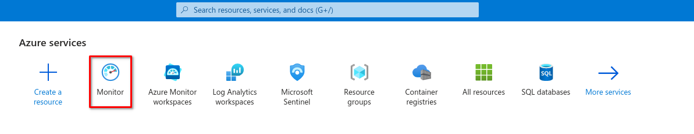
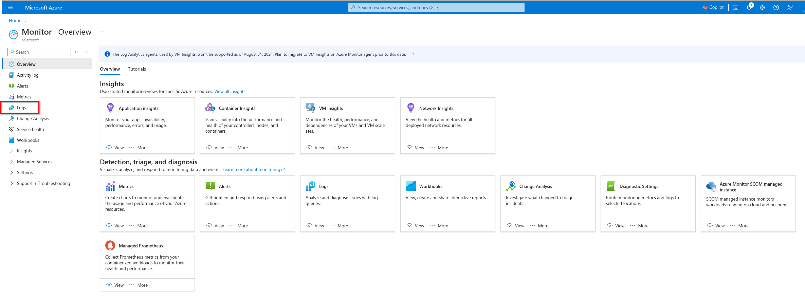
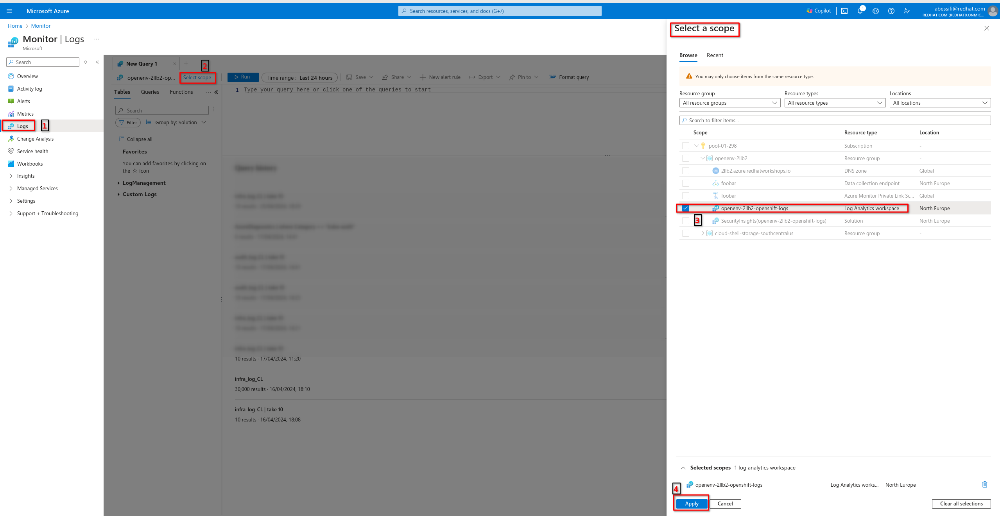
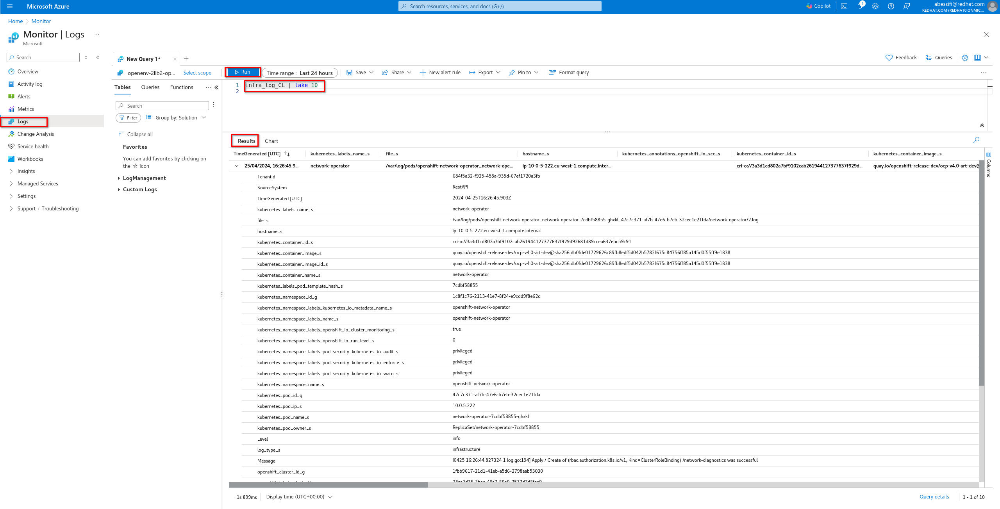

## OpenShift Logging

With a Red Hat OpenShift OKE subscription the `OpenShift Logging Operator` could not be used to set up an aggregated logging stack for the cluster. Only the LogForwarding feature is available to help exporing logs to Azure Monitor service or [another supported system](https://docs.openshift.com/container-platform/4.14/observability/logging/log_collection_forwarding/logging-output-types.html#supported-log-outputs_logging-output-types). This feature is only available and supported with `Vector`.

This chart aims to:

- Enable OpenShift LogForwarder
- Set up LogForwarding to send cluster logs to Azure Monitor (via Vector)

> **_NOTE:_** Cluster logging and the Red Hat OpenShift Logging Operator is only deployable to the `openshift-logging` namespace. To enable metrics service discovery add namespace label `openshift.io/cluster-monitoring: "true".`

## Requirements

To enable OpenShift logs forwarding to Azure Monitor, you need:

- A Log Analytics Workspace created
- OpenShift cluster-admin access
- The Red Hat OpenShift Logging Operator 5.9 or later installed on your cluster. You can leverage the `operator-utils` chart to install it.
- Helm version 3.8 or greater

## Usage

### Use case 1 - Forwarding to Azure Monitor Logs via Public Network

The `Workspace ID` and the `Shared Key` are the two required parameters for this configuration.

You can run the following commands to get these parameters if you have access to Azure APIs with the AZ CLI.

```bash
WORKSPACE_ID=$(az monitor log-analytics workspace show -g <AZ RESOURCE GROUP> -n <AZ LOG WORKSPACE NAME> -o tsv --query customerId)

SHARED_KEY=$(az monitor log-analytics workspace get-shared-keys -g <AZ RESOURCE GROUP> -n <AZ LOG WORKSPACE NAME> -o tsv --query primarySharedKey)
```

> **_NOTE:_** This chart does not yet support integration with a Secret Manager. In this case the OpenShift Secret that holds the `Azure Monitor Workspace Shared Key` should be created manually.

#### Set up

The following procedure configures the `OpenShift Logging Forwarder` using this Helm Chart. This method supports a simplified installation path compared to a GitOps one that could rely on ArgoCD for instance.

1. Create a secret for your Azure workspace

```yaml
apiVersion: v1
kind: Secret
metadata:
  name: azure-workspace-key
  namespace: openshift-logging
type: Opaque
data:
  shared_key: <base64-encoded-shared-key>
```

2. Update your `values.yaml` file and run the helm install command:

```bash

cd /some/where/

git clone <this-repo>

cd openshift-gitops/helm-charts/

helm install \
  --namespace openshift-logging \
  --values openshift-log-forwarding/values.yaml \
  <release-name> \
  openshift-log-forwarding/
```

This will create a `ClusterLogging` instance with `Vector` as log collector.

3. Verify the Operator installation

Check the contents of the specified namespace (openshift-logging) to ensure all pods and services have started successfully.

```bash
oc get pods,ds,svc -n openshift-logging
```

The response should resemble the following:

```bash
NAME                                            READY   STATUS      RESTARTS   AGE
pod/collector-hw7dm                             1/1     Running     0          7m32s
[...]

NAME                                       TYPE        CLUSTER-IP      EXTERNAL-IP   PORT(S)     AGE
service/collector                          ClusterIP   172.30.37.74    <none>        24231/TCP   7m53s
[...]

NAME                       DESIRED   CURRENT   READY   UP-TO-DATE   AVAILABLE   NODE SELECTOR            AGE
daemonset.apps/collector   1         1         1       1            1           kubernetes.io/os=linux   7m52s
```

#### Check for logs in Azure

Wait 5 to 15 minutes until the logs are pushed to Azure, then Query your Azure Log Analytics Workspace









You can also use the CLI to checkout the logs:

```bash
$ az monitor log-analytics query -w $WORKSPACE_ID  --analytics-query "<your-log-type-string> | take 10" --output tsv
```

### Use case 2 - Use Azure Private Link to connect OpenShift on-premise to Azure Monitor

With Private Link you can:

- Connect privately to Azure Monitor without opening up any public network access.
- Ensure your monitoring data is only accessed through authorized private networks.
- Keep all traffic inside the Azure backbone network.

#### Requirements

- Your on-premise network connected to Azure VNET where Azure Monitor service is enabled
- OpenShift cluster on-premise could reach

>With Azure Private Link, you can securely link Azure platform as a service (PaaS) resources to your virtual network by using private endpoints. Azure Monitor is a constellation of different interconnected services that work together to monitor your workloads. An Azure Monitor private link connects a private endpoint to a set of Azure Monitor resources to define the boundaries of your monitoring network. That set is called an Azure Monitor Private Link Scope (AMPLS).


## Development

### Create Azure Monitor Workspace

1. Download AZ CLI

```bash
curl -L https://aka.ms/InstallAzureCli | bash
```

2. You can login to the subscription using the service principal

```bash
export AZ_CLIENT_ID=xxxxxxx
export AZ_PASSWORD=xxxxxxx
export AZ_TENANT=xxxxxxx
export AZ_SUBSCRIPTION=xxxxxxx
export AZ_RESOURCEGROUP=xxxxxxx
export AZ_LOCATION=xxxxxxx

az login --service-principal -u $AZ_CLIENT_ID -p $AZ_PASSWORD --tenant $AZ_TENANT
```

3. Create Azure Monitor Workspace

```bash
export AZ_LOG_WORKSPACE_NAME=xxxxxx

az monitor log-analytics workspace create \
 -g $AZ_RESOURCEGROUP -n $AZ_LOG_WORKSPACE_NAME \
 -l $AZ_LOCATION
```

### Render chart templates

Render chart templates locally and display the output. Any values that would normally be looked up or retrieved in-cluster will be faked locally.
Additionally, none of the server-side testing of chart validity (e.g. whether an API is supported) is done.

```bash
helm template --values openshift-log-forwarding/values.yaml openshift-logging/
```


## TODO

- [ ] Adapt and test the manifests to work for the Servier's OpenShift target architecture
- [ ] Leverage Azure Vault for chart's secrets management
- [ ] Add ArgoCD syncwave annotations to make the `ClusterLogging` CR is created before `ClusterLogForwarder` one. 

## References

- [OpenShift Kubernetes Engine - Available Features](https://docs.openshift.com/container-platform/4.14/welcome/oke_about.html)
- [Configuring log forwarding to Azure Monitor](https://docs.openshift.com/container-platform/4.14/logging/log_collection_forwarding/configuring-log-forwarding.html#logging-forwarding-azure_configuring-log-forwarding)
- [Vector Azure Monitor Logs sink](https://vector.dev/docs/reference/configuration/sinks/azure_monitor_logs/)
- [Use of Azure Private Link](https://learn.microsoft.com/en-gb/azure/azure-monitor/logs/private-link-security#configure-access-to-your-resources)
